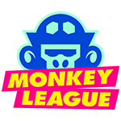

<h1 align="center">
  
</h1>

# Staking Program

Program for single token staking and receiving rewards.

Features:

- Stake / unstake
- Updatable lock up date
- Possibility to display the staked amount & reward separately.

## Note

- **This code is unaudited. Use at your own risk.**
- In this implementation the pool shares are stored in a program-owned account (PDA).

## Developing

[Anchor](https://github.com/project-serum/anchor) is used for development, and its
recommended workflow is used here. To get started, see the [guide](https://project-serum.github.io/anchor/getting-started/introduction.html).
